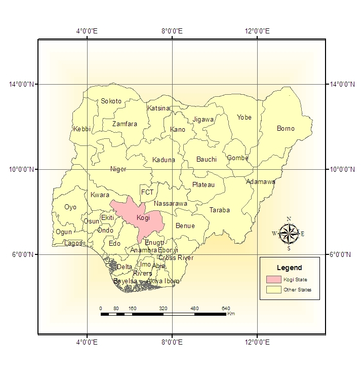
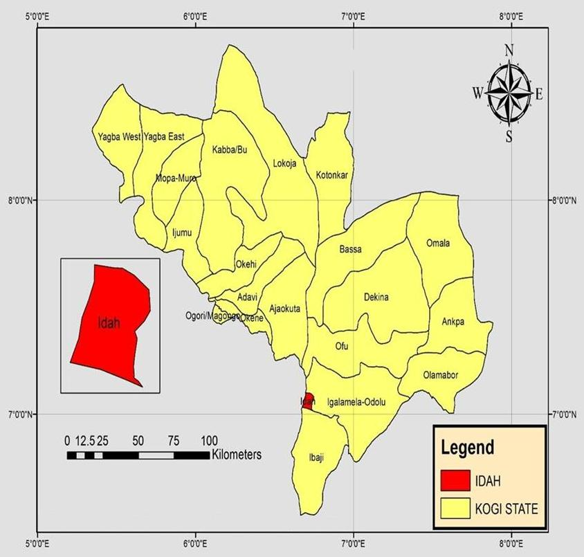
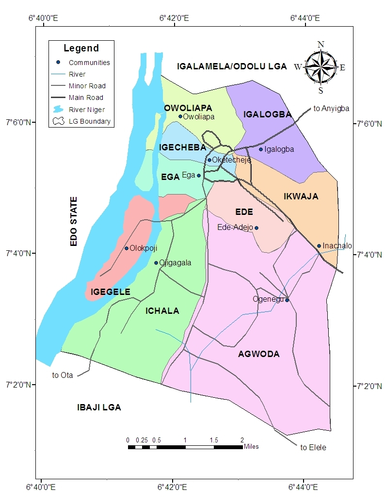
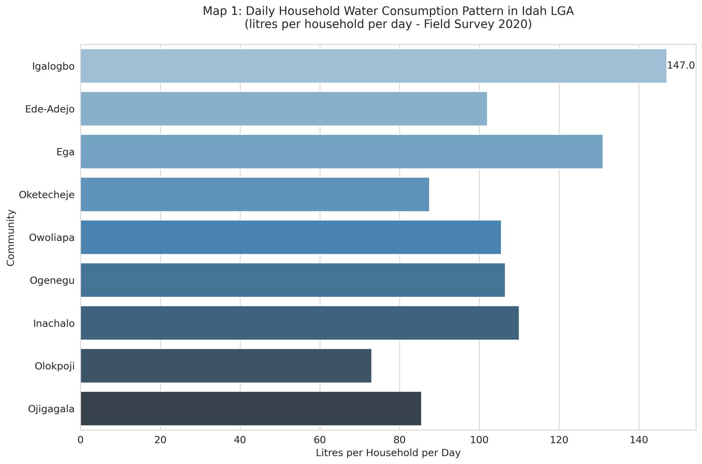
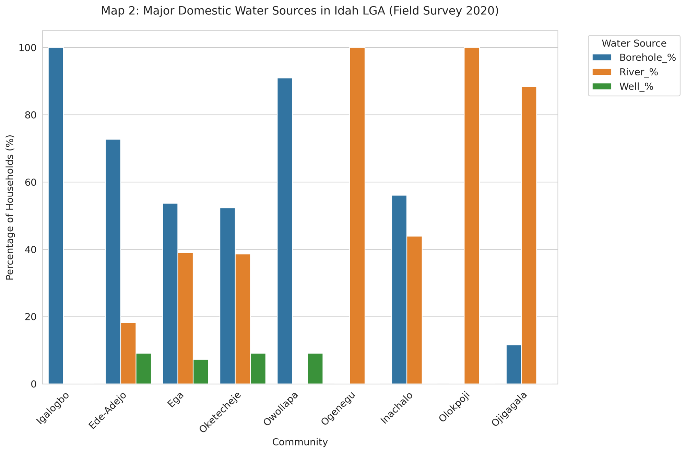
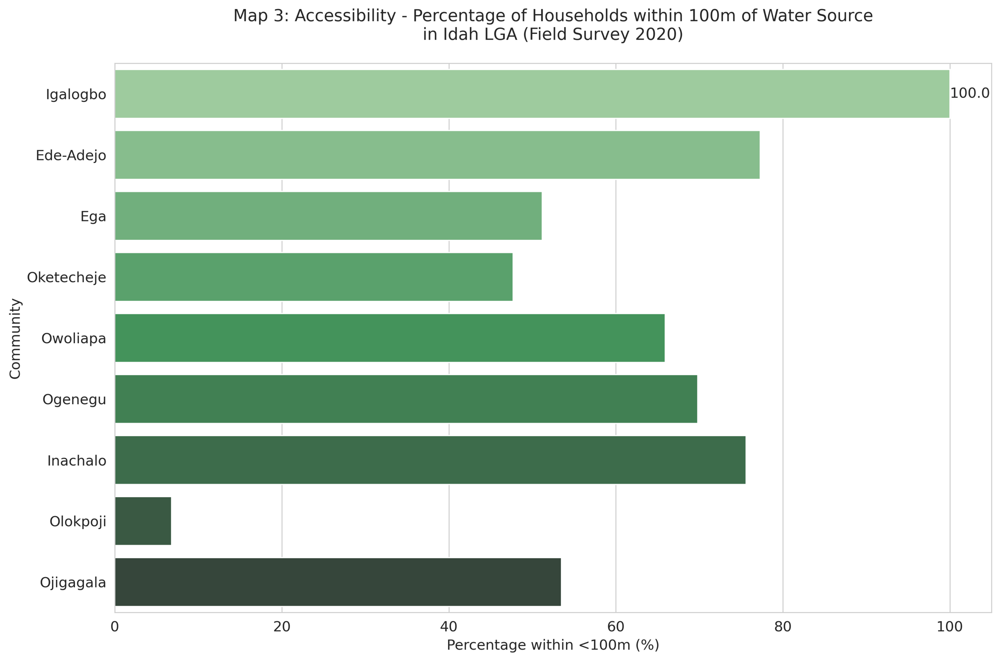
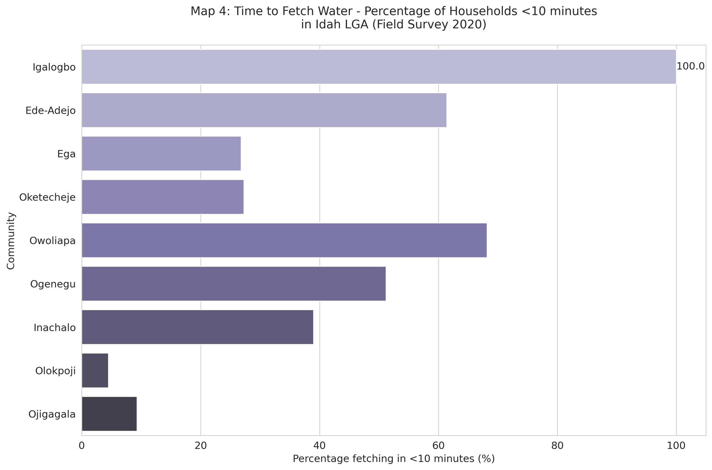

IDAH LGA WATER CONSUMPTION STUDY AREA 

PROJECT OVERVIEW 

This project presents a GIS based study area mapping of Idah Local Government Area in Kogi State, Nigeria. The maps were produced as part of a BSc Geography undergraduate thesis at Kogi State University, Anyigba, completed in 2020.

The aim is to provide a clear spatial framework for analysing domestic water consumption patterns and to demonstrate the application of GIS in environmental research.

---

STUDY AREA CONTEXT 

Nigeria showing Kogi State

  

Kogi State showing Idah LGA

  

Idah LGA Study Area

  

---

METHODOLOGY 

The maps were developed using standard GIS procedures:

- Acquisition of administrative boundary data
- Data preparation and organisation within a GIS environment
- Clipping and extraction of the study area
- Application of symbology to distinguish spatial units
- Map layout design including legend, scale bar, and north arrow

---

DATA AND TOOLS 

- Software used: ArcGIS
- Coordinate System: WGS 84 (EPSG:4326)
- Data type: Administrative boundary shapefiles

---

OUTPUTS 

The project includes:

- Nigeria context map
- Kogi State context map
- Idah LGA study area map

These outputs provide the spatial basis for analysing water consumption patterns.

---

SKILLS DEMONSTRATED 

- Geographic Information Systems (GIS)
- Spatial data processing and management
- Cartographic design and map composition
- Spatial analysis and visualisation
- Geographic interpretation

---

RELATED PUBLICATIONS 

- Journal Article (2023): Assessment of the Drivers of Domestic Water Consumption Pattern in Idah LGA, Kogi State
- Book Chapter (2024): Assessment of the Drivers of Domestic Water Consumption Pattern in a Growing Population of Idah LGA, Kogi State, Nigeria

---

STUDY AREA DESCRIPTION 

Idah LGA is located in Kogi State in central Nigeria, along the eastern bank of the River Niger. The area plays an important role in regional administration and provides a useful case for analysing water access and consumption patterns.

---

## THEMATIC GIS MAPS
**Designed by Stephen Favour Ojonuba (Primary Researcher)**

These 4 thematic maps were created by **Stephen Favour Ojonuba** as part of the BSc Geography Thesis: *GIS Mapping & Spatial Analysis of Domestic Water Consumption in Idah LGA, Kogi State (2020)*.  

The maps visualise primary survey data (400 households across 9 communities) that formed the foundation for the peer-reviewed journal article and Wiley book chapter.

### Map 1: Daily Household Water Consumption Pattern
  
*Average consumption: 105.1 litres per person per day (Field Survey 2020)*

### Map 2: Major Domestic Water Sources
  
*Boreholes (48.6%) vs Rivers (47.5%) – Field Survey 2020*

### Map 3: Accessibility – Distance to Water Source
  
*Percentage of households within <100 m of water source (60.7% overall)*

### Map 4: Time to Fetch Water
  
*Percentage of households fetching water in <10 minutes*

---

**AUTHOR**  
Stephen Favour Ojonuba  
BSc Geography, Kogi State University, Anyigba  

**PROJECT SUMMARY**  
Stephen Favour Ojonuba developed the spatial framework and produced these thematic outputs in ArcGIS. The maps directly supported the findings published in:  
- *The Journal of Development Practice* (2023)  
- *Disaster Management and Environmental Sustainability* (John Wiley & Sons, 2024)

Full repository: https://github.com/favstev/idah-lga-study-area-map
